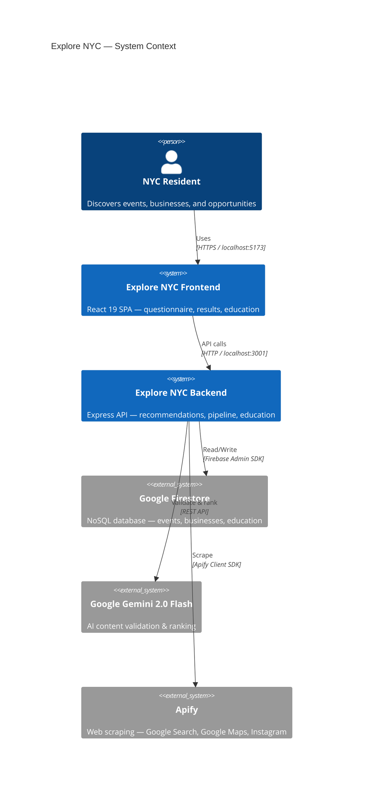
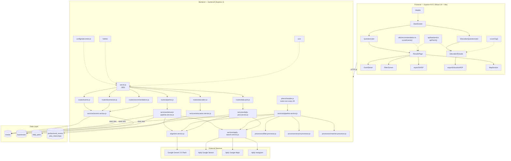
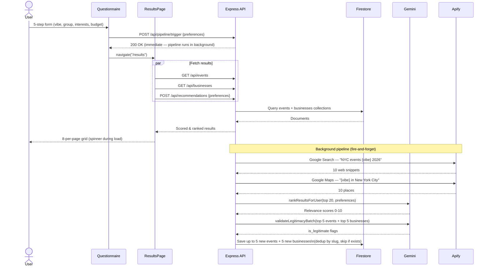
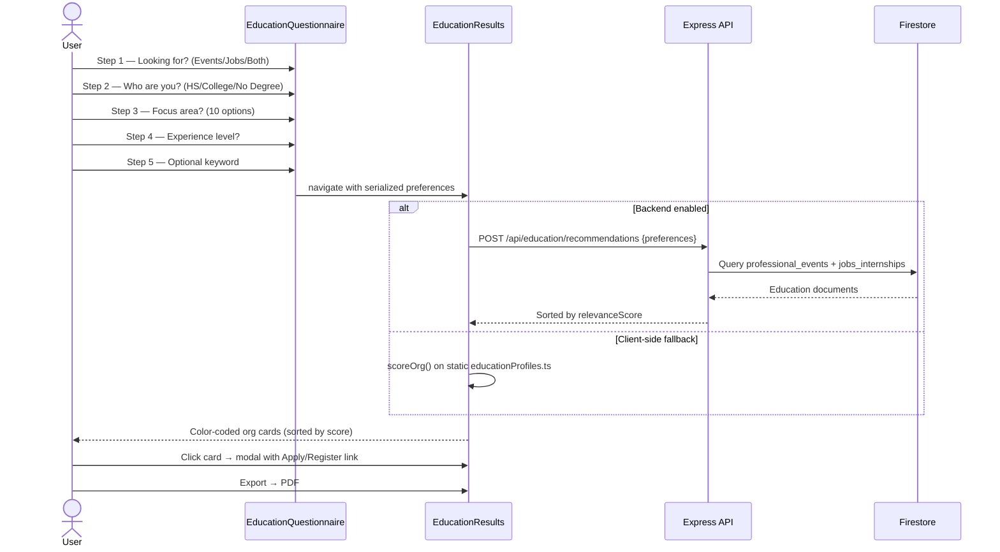
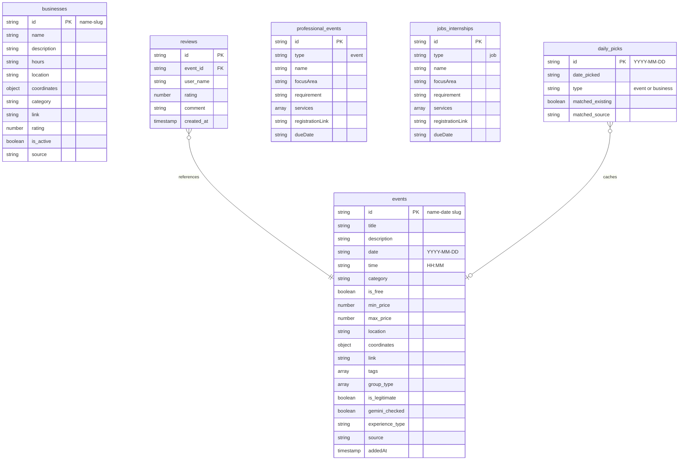
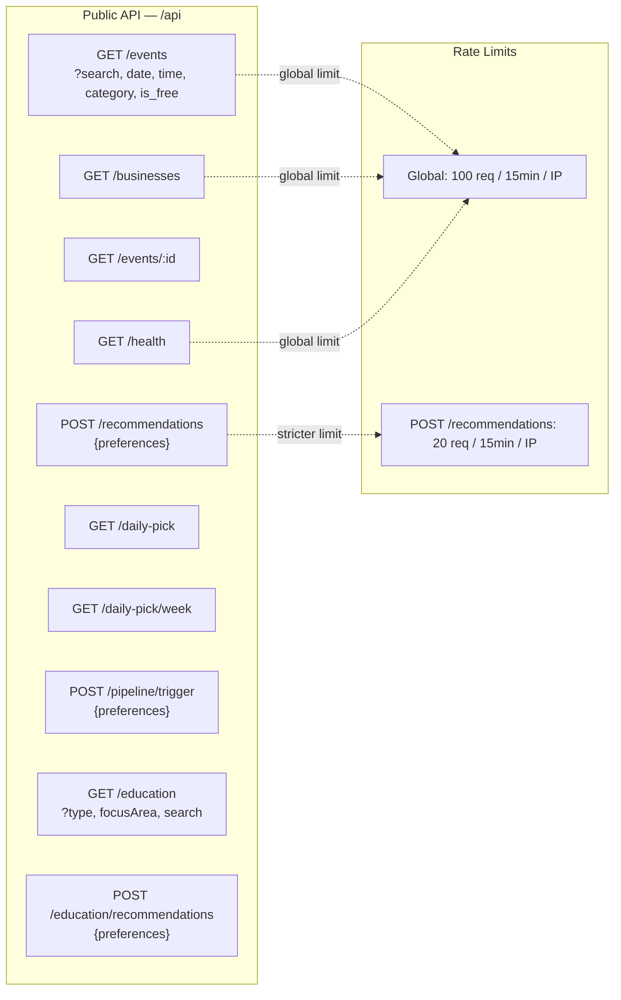
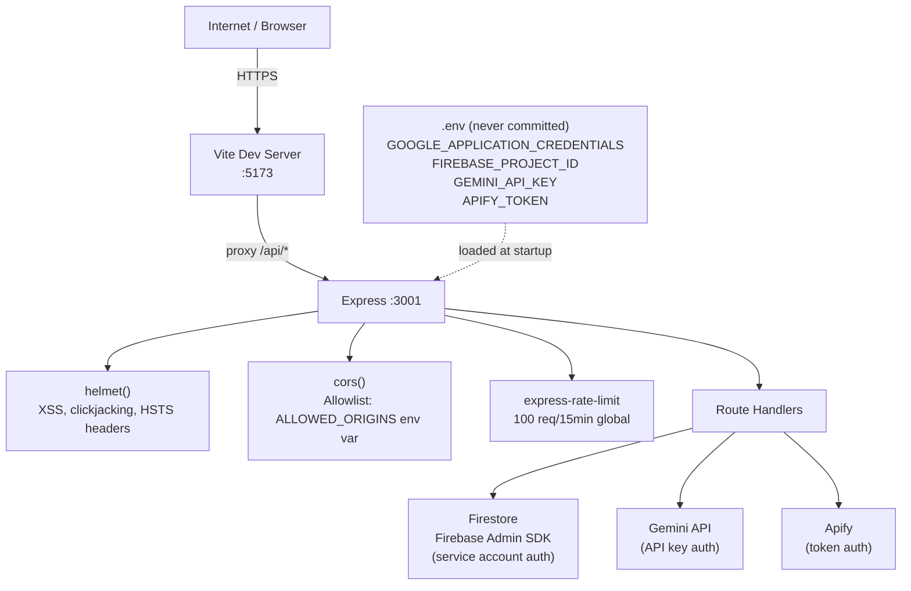

# Explore NYC — System Architecture

Full system architecture diagrams for the Explore NYC platform.

---

## 1. High-Level System Overview

---

## 2. Component Architecture

---

## 3. NYC Explorer Data Flow

---

## 4. High Education Data Flow

---

## 5. Pipeline Architecture

```mermaid
graph TB
    subgraph Triggers["Pipeline Triggers"]
        T1["User submits questionnaire\nPOST /api/pipeline/trigger"]
        T2["node-cron\n0 */6 * * *\nevery 6 hours"]
        T3["GET /api/daily-pick\n(cache miss)"]
    end

    subgraph DemandPipeline["Demand Pipeline\ndemand-pipeline.service.js"]
        D1[searchEvents\nApify Google Search]
        D2[searchBusinesses\nApify Google Maps]
        D3[rankResultsForUser\nGemini 2.0 Flash]
        D4[validateLegitimacyBatch\nGemini 2.0 Flash]
        D5[saveNewEvents\nmax 5, dedup by slug]
        D6[saveNewBusinesses\nmax 5, dedup by slug]
        D1 --> D3
        D2 --> D3
        D3 --> D4
        D4 --> D5 & D6
    end

    subgraph ScheduledPipeline["Scheduled Pipeline\npipeline.service.js"]
        S1[Apify Instagram\nhashtag dataset]
        S2[Apify Google Search\n& Maps]
        S3[filter.processor\nisRelevant]
        S4[gemini.service\nstructureSearchResult]
        S5[event.processor\nnormalizeEvent]
        S6[matcher.processor\nmatchToExisting]
        S7[saveEvent\n3-5 per run]
        S1 & S2 --> S3 --> S4 --> S5 --> S6 --> S7
    end

    subgraph DailyPick["Daily Pick\ndaily-pick.service.js"]
        P1{Cache hit\ndaily_picks/YYYY-MM-DD?}
        P2[Apify Instagram\n1 post]
        P3[Gemini\n1 classifyContent call]
        P4[matcher.processor\nmatchToExisting]
        P5[Cache in Firestore\ndaily_picks/YYYY-MM-DD]
        P1 -->|Hit| POut[Return cached pick]
        P1 -->|Miss| P2 --> P3 --> P4 --> P5
    end

    T1 --> DemandPipeline
    T2 --> ScheduledPipeline
    T3 --> DailyPick

    DemandPipeline -->|Write| Firestore_E[(events)]
    DemandPipeline -->|Write| Firestore_B[(businesses)]
    ScheduledPipeline -->|Write| Firestore_E
    DailyPick -->|Write| Firestore_D[(daily_picks)]
```

---

## 6. Firestore Data Model

---

## 7. API Endpoints Summary

---

## 8. Security Model

