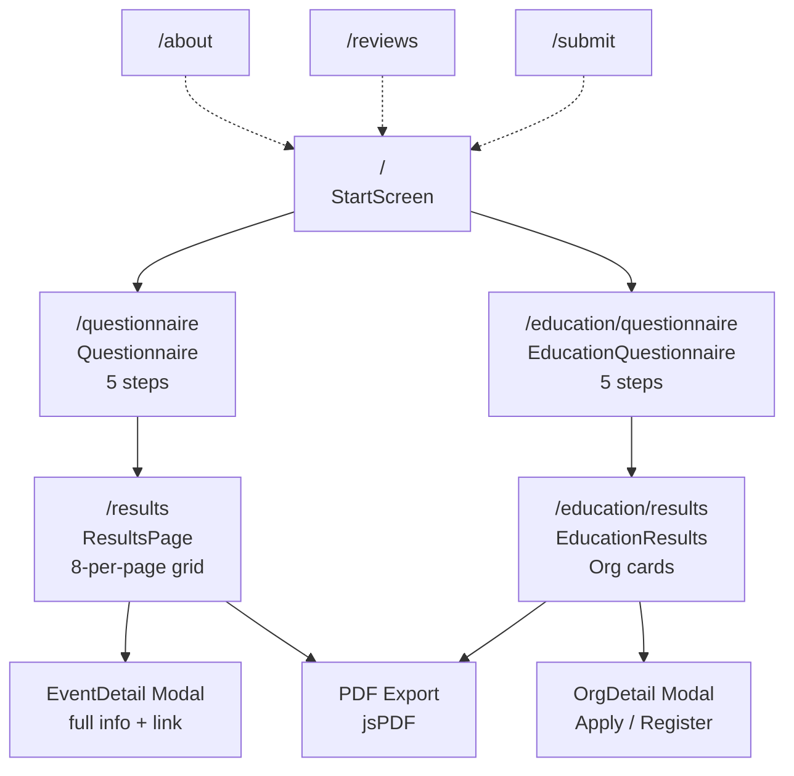
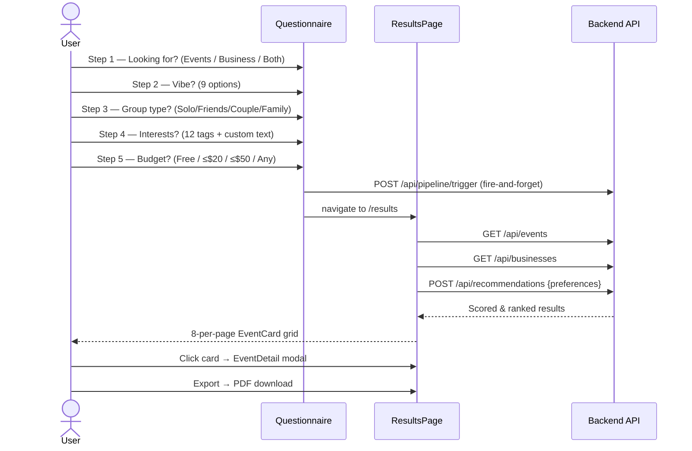
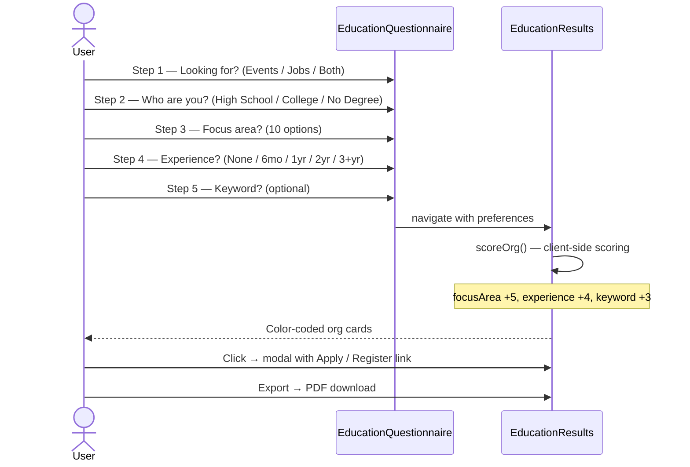

# Explore NYC — Frontend

React 19 + TypeScript frontend for the Explore NYC application. Presents two guided flows — **NYC Explorer** (events & businesses) and **High Education** (professional programs & jobs) — with AI-backed recommendations, filterable result grids, and PDF export.

---

## Tech Stack

| Layer | Technology | Version |
|---|---|---|
| Framework | React | 19.2.4 |
| Language | TypeScript | ~6.0.2 |
| Build Tool | Vite | 8.0.4 |
| Styling | TailwindCSS | v4.2.2 |
| Routing | React Router | v7.14.0 |
| PDF Export | jsPDF | 4.2.1 |
| Icons | React Icons | 5.6.0 |
| Maps | @vis.gl/react-google-maps | 1.8.3 |
| Compiler | React Compiler (Babel) | 1.0.0 |

---

## Application Flow



### NYC Explorer Flow



### High Education Flow



---

## Project Structure

```
Explore-NYC/
├── public/
└── src/
    ├── App.tsx                      # React Router v7 route definitions
    ├── main.tsx                     # Application entry point
    ├── Layout.tsx                   # Shared layout wrapper
    ├── index.css                    # Global styles + TailwindCSS tokens
    │
    ├── api/
    │   └── backend.ts               # apiFetch() wrapper — proxies /api/* to :3001
    │
    ├── home/
    │   └── StartScreen.tsx          # Landing page — mode selector
    │
    ├── questionary/
    │   └── Questionnaire.tsx        # 5-step NYC Explorer questionnaire
    │
    ├── results/
    │   └── ResultsPage.tsx          # Event/business results grid (8 per page)
    │
    ├── filter/
    │   └── FilterScreen.tsx         # Date & time filter overlay
    │
    ├── components/
    │   ├── EventCard.tsx            # Card component (color-coded by category)
    │   ├── EventDetail.tsx          # Full event detail modal
    │   ├── Header.tsx               # App header + navigation
    │   └── MapSection.tsx           # Google Maps embed
    │
    ├── education/
    │   ├── EducationQuestionnaire.tsx  # 5-step education questionnaire
    │   └── EducationResults.tsx        # Org results + scoring
    │
    ├── pages/
    │   ├── AboutPage.tsx            # About page
    │   ├── ReviewPage.tsx           # User reviews
    │   └── SubmitPage.tsx           # Submit new event/business
    │
    ├── data/
    │   └── educationProfiles.ts     # Static fallback data for education
    │
    ├── utils/
    │   ├── recommendation.ts        # scoreEvents(), filterEvents() — client-side scoring
    │   ├── exportToPDF.ts           # jsPDF export for event results
    │   └── exportEducationPDF.ts    # jsPDF export for education results
    │
    ├── types/
    │   └── index.ts                 # TypeScript interfaces (Event, UserPreferences, etc.)
    │
    └── assets/
        ├── maps/                    # Map assets
        └── (images, fonts)
```

---

## Routes

| Path | Component | Description |
|---|---|---|
| `/` | `StartScreen` | Landing page — mode selector |
| `/questionnaire` | `Questionnaire` | 5-step NYC Explorer form |
| `/results` | `ResultsPage` | Scored event/business grid |
| `/about` | `AboutPage` | About page |
| `/reviews` | `ReviewPage` | User reviews |
| `/submit` | `SubmitPage` | Submit new listing |
| `/education/questionnaire` | `EducationQuestionnaire` | 5-step education form |
| `/education/results` | `EducationResults` | Scored org/job grid |

---

## Client-Side Scoring

`utils/recommendation.ts` scores events without an API call as a fallback:

| Signal | Weight |
|---|---|
| Vibe keyword match in tags/description | +3 per match |
| Group type match | +2 per match |
| Custom interest keyword match | +2 per keyword |
| Price match (`free` / `up20` / `up50` / `any`) | +1–3 |

`utils` for education scoring (inline in `EducationResults.tsx`):

| Signal | Weight |
|---|---|
| Focus area match | +5 |
| Experience requirement fit | +4 |
| Keyword match in description | +3 |

---

## API Client

`api/backend.ts` exports `apiFetch(path, options?)` which:

- Prepends `/api` to all paths
- Vite proxy forwards `/api/*` → `http://localhost:3001` in development
- Throws on non-2xx responses with the server error message

---

## Prerequisites

- Node.js v18 or higher
- Backend running on `http://localhost:3001` — see [`backend/Readme.md`](../backend/Readme.md)

---

## Setup & Run

```bash
cd Explore-NYC
npm install
npm run dev
```

Open [http://localhost:5173](http://localhost:5173).

---

## Available Scripts

| Command | Description |
|---|---|
| `npm run dev` | Start dev server with hot reload at `:5173` |
| `npm run build` | Type-check + production build to `dist/` |
| `npm run preview` | Preview the production build locally |
| `npm run lint` | Run ESLint across all source files |

---

## Color Scheme

| Token | Hex | Usage |
|---|---|---|
| Primary | `#AD2B0B` | Backgrounds, brand headers |
| Accent | `#F04251` | Buttons, highlights |
| Card Light | `#65CDB6` | Event cards (even index) |
| Card Dark | `#2D8B76` | Event cards (odd index) |
| Background | `#EDEDEE` | Page background |

---

## Vite Proxy

`vite.config.ts` proxies all `/api/*` requests to the backend in development:

```ts
server: {
  proxy: {
    '/api': 'http://localhost:3001'
  }
}
```

This means the frontend never hard-codes the backend URL — just call `/api/events`.
