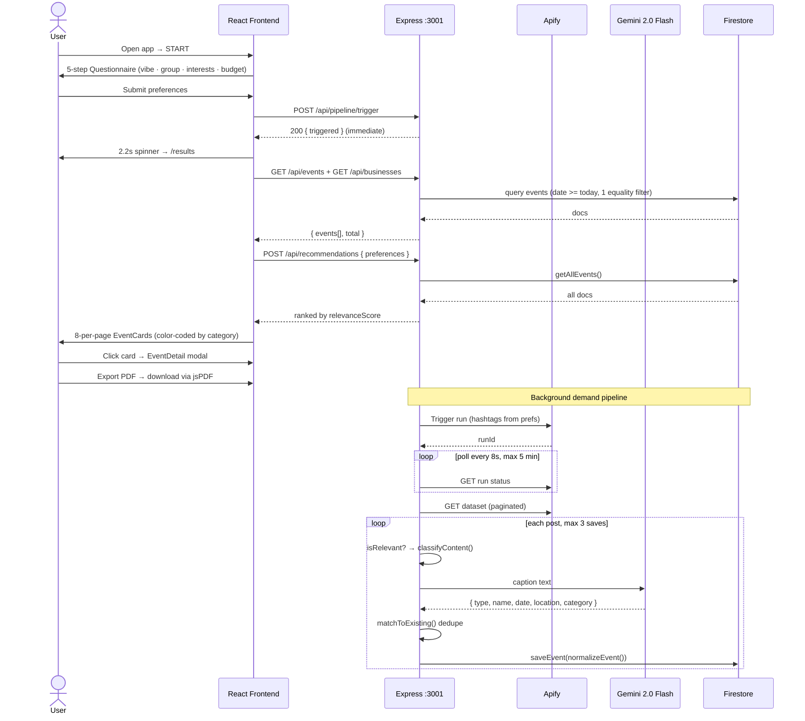
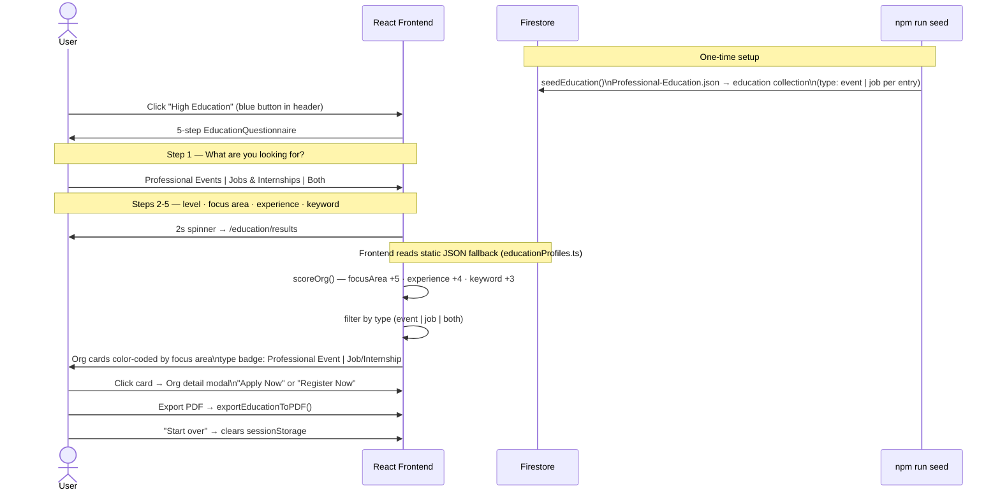
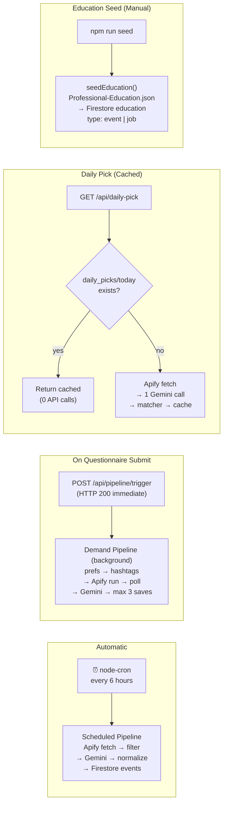
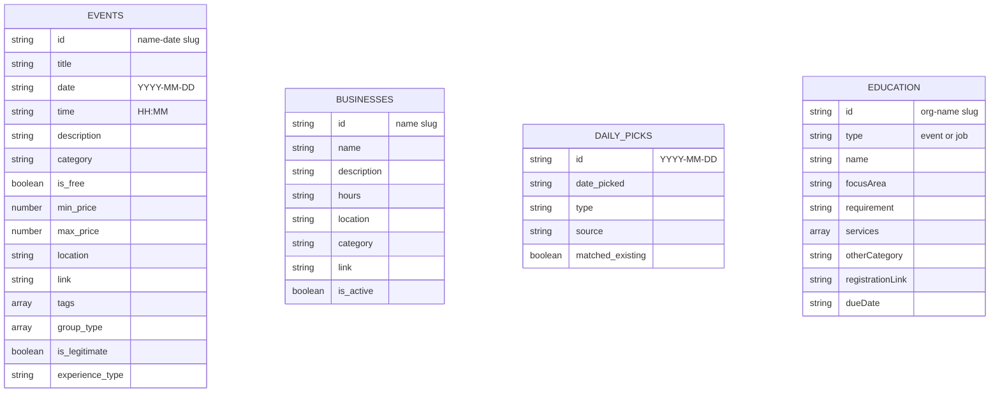

# Explore NYC — How the Project Works

```mermaid
flowchart TD

    %% ═══════════════════════════════════════════════════
    %% FRONTEND
    %% ═══════════════════════════════════════════════════

    subgraph BROWSER["Browser — React 19 + Vite + TailwindCSS"]
        direction TB

        subgraph HEADER["Header.tsx — sticky nav"]
            H1["Home page button  (red · #F04251)"]
            H2["High Education button  (blue · #4A9EE0)\nActive = #2563eb"]
            H3["About · Reviews · Submit"]
        end

        subgraph MAIN_FLOW["NYC Explorer — Events & Businesses"]
            START["StartScreen /\nEXPLORE NYC"]

            subgraph QUEST["Questionnaire /questionnaire · 5 steps"]
                Q1["Step 1: Looking for?\nEvents · Local Business · Both"]
                Q2["Step 2: Vibe?\n9 options — Outdoors · Arts · Gaming…"]
                Q3["Step 3: Group?\nSolo · Friends · Couple · Family"]
                Q4["Step 4: Interests?\nText + 12 tags"]
                Q5["Step 5: Budget?\nFree · ≤$20 · ≤$50 · Any"]
                Q1 --> Q2 --> Q3 --> Q4 --> Q5
            end

            subgraph RESULTS["ResultsPage /results"]
                RS1["scoreEvents()\nutils/recommendation.ts\nvibe +3 · group +2 · interests +2 · price +1-3"]
                RS2["FilterScreen\nsearch · date · time · price"]
                RS3["8 cards per page\nEventCard (category color-coded)"]
                RS4["EventDetail modal"]
                RS5["exportToPDF() — jsPDF"]
                RS1 --> RS2 --> RS3 --> RS4
                RS3 --> RS5
            end

            START -->|"START"| QUEST
            Q5 -->|"2.2s spinner · sessionStorage"| RESULTS
        end

        subgraph EDU_FLOW["High Education — Programs & Jobs"]
            subgraph EDU_QUEST["EducationQuestionnaire\n/education/questionnaire · 5 steps"]
                EQ1["Step 1: Looking for?\nProfessional Events · Jobs & Internships · Both"]
                EQ2["Step 2: Who are you?\nHigh School · College · No Degree"]
                EQ3["Step 3: Focus area?\n10 options — Technology · STEAM · Law…"]
                EQ4["Step 4: Experience?\nNone · 6mo · 1yr · 2yr · 3+yr"]
                EQ5["Step 5: Extra keyword? (optional)"]
                EQ1 --> EQ2 --> EQ3 --> EQ4 --> EQ5
            end

            subgraph EDU_RESULTS["EducationResults\n/education/results"]
                ER1["scoreOrg()\nfocusArea +5 · experience +4 · keyword +3"]
                ER2["Filter by type (event|job|both)\nfocusArea · registration status · level"]
                ER3["Org cards (focus-area color-coded)\ntype badge: Professional Event | Job/Internship"]
                ER4["Org detail modal\nApply Now / Register Now link"]
                ER5["exportEducationToPDF()\nutils/exportEducationPDF.ts"]
                ER1 --> ER2 --> ER3 --> ER4
                ER3 --> ER5
            end

            EQ5 -->|"2s spinner · sessionStorage"| EDU_RESULTS
        end

        H2 -->|"navigate"| EDU_QUEST
        H1 -->|"navigate"| QUEST
    end

    %% ═══════════════════════════════════════════════════
    %% API CLIENT
    %% ═══════════════════════════════════════════════════

    subgraph API_CLIENT["src/api/backend.ts — apiFetch wrapper"]
        AF1["fetchEvents(params)\nGET /api/events"]
        AF2["fetchBusinesses()\nGET /api/businesses"]
        AF3["fetchRecommendations(prefs)\nPOST /api/recommendations"]
        AF4["fetchDailyPick()\nGET /api/daily-pick"]
        AF5["triggerPipeline(prefs)\nPOST /api/pipeline/trigger · fire-and-forget"]
    end

    subgraph EDU_DATA["src/data/educationProfiles.ts\nStatic fallback — reads JSON directly"]
        ED1["EDUCATION_PROFILES[]\ntype · name · focusArea · requirement\nservices[] · otherCategory\nregistrationLink · dueDate"]
    end

    %% ═══════════════════════════════════════════════════
    %% EXPRESS SERVER
    %% ═══════════════════════════════════════════════════

    subgraph SERVER["Express Server · server.js · PORT 3001"]
        MW["helmet() → cors() → express.json(10kb)\nglobalLimiter → recommendationsLimiter"]

        subgraph ROUTES["Routes"]
            RT1["GET /api/events"]
            RT2["GET /api/businesses"]
            RT3["POST /api/recommendations"]
            RT4["GET /api/daily-pick  /week"]
            RT5["POST /api/pipeline/trigger"]
            RT6["GET  /api/education\nPOST /api/education/recommendations"]
            RT7["GET /api/health"]
        end

        MW --> ROUTES
    end

    %% ═══════════════════════════════════════════════════
    %% SERVICES
    %% ═══════════════════════════════════════════════════

    subgraph SERVICES["Services — Business Logic"]
        SVC1["events.service.js\nqueryEvents · getEventById · getAllEvents\n1 Firestore equality filter + in-memory\nhide is_legitimate===false"]
        SVC2["recommendations.js (inline)\nVIBE_KEYWORDS · GROUP_KEYWORDS\nrelevanceScore sort"]
        SVC3["daily-pick.service.js\ngetDailyPick() · getWeeklyPicks()\nFirestore cache daily_picks/YYYY-MM-DD"]
        SVC4["demand-pipeline.service.js\npreferencesToHashtags\ntriggerApifyRun · waitForRun\nfetchDataset · max 3 saves"]
        SVC5["pipeline.service.js · runPipeline()"]
        SVC6["startup-check.service.js\nrunStartupChecks() on boot"]
        SVC7["business-checker.service.js\nvalidateLegitimacyBatch()"]
        SVC8["education.service.js\nqueryEducation(filters)\nrecommendEducation(prefs)\nReads Firestore 'education'"]
    end

    %% ═══════════════════════════════════════════════════
    %% PROCESSORS
    %% ═══════════════════════════════════════════════════

    subgraph PROC["Processors"]
        P1["filter.processor.js · isRelevant(text)"]
        P2["event.processor.js · normalizeEvent(aiResult)"]
        P3["matcher.processor.js · matchToExisting(aiResult)"]
    end

    %% ═══════════════════════════════════════════════════
    %% AI
    %% ═══════════════════════════════════════════════════

    subgraph AI["AI Layer · ai/gemini.service.js"]
        GEM1["classifyContent(text)\n→ type · name · date · location · category"]
        GEM2["validateLegitimacyBatch(items[])\n→ is_legitimate · confidence · reason"]
        GEM3["validateLegitimacy(item) — wrapper"]
        GEM3 --> GEM2
    end

    subgraph EXTERNAL["External APIs"]
        GEMINI_API["Gemini 2.0 Flash\ntemp=0 · maxTokens=200"]
        APIFY_API["Apify Instagram Scraper\n5 runs/month free tier"]
    end

    %% ═══════════════════════════════════════════════════
    %% DATABASE
    %% ═══════════════════════════════════════════════════

    subgraph DB["Firebase Firestore — Free Tier"]
        FS1["events\nname·date·time·category\nis_free·location·tags[]·is_legitimate"]
        FS2["businesses\nname·hours·location·category·is_active"]
        FS3["daily_picks\nYYYY-MM-DD · cached once/day"]
        FS4["education\ntype: event|job · name · focusArea\nrequirement · services[] · dueDate"]
    end

    subgraph SEED["Seed · database/seed.js\nnpm run seed"]
        SD1["seedEvents()\nevents.json → Firestore events"]
        SD2["seedBusinesses()\nlocal-business.json → Firestore businesses"]
        SD3["seedEducation()\nProfessional-Education.json\n→ Firestore education\ntype: event | job"]
    end

    subgraph CRON["Scheduled"]
        SCHED["jobs/scheduler.js\nnode-cron: every 6h → runPipeline()"]
    end

    %% ═══════════════════════════════════════════════════
    %% CONNECTIONS
    %% ═══════════════════════════════════════════════════

    %% Frontend → API client
    RESULTS  --> AF1 & AF2 & AF3
    Q5       -->|fire-and-forget| AF5
    EDU_RESULTS --> ED1

    %% API client → server
    AF1 --> RT1
    AF2 --> RT2
    AF3 --> RT3
    AF4 --> RT4
    AF5 --> RT5

    %% Routes → services
    RT1 --> SVC1
    RT2 --> SVC1
    RT3 --> SVC2
    RT4 --> SVC3
    RT5 -->|background| SVC4
    RT6 --> SVC8

    %% Cron
    SCHED --> SVC5

    %% Services → processors
    SVC4 & SVC5 & SVC3 --> P1 & P2
    SVC4 & SVC3 --> P3

    %% Services → AI
    SVC4 & SVC5 & SVC3 --> GEM1
    SVC7 --> GEM2

    %% AI → external
    GEM1 & GEM2 --> GEMINI_API

    %% Services → Apify
    SVC4 & SVC5 & SVC3 --> APIFY_API

    %% Services → DB
    SVC1 --> FS1
    SVC2 --> FS1
    SVC3 --> FS1 & FS3
    SVC4 & SVC5 --> FS1
    SVC8 --> FS4

    %% Seed → DB
    SD1 --> FS1
    SD2 --> FS2
    SD3 --> FS4

    %% Styling
    classDef fe       fill:#1a3a1a,stroke:#52b788,color:#fff
    classDef eduFe    fill:#0d2240,stroke:#4A9EE0,color:#fff
    classDef apiCl    fill:#2d3a5a,stroke:#6090d0,color:#fff
    classDef srv      fill:#2a2a4a,stroke:#6a6aaa,color:#fff
    classDef svc      fill:#3a1a5a,stroke:#8a5aaa,color:#fff
    classDef eduSvc   fill:#0d2240,stroke:#4A9EE0,color:#fff
    classDef proc     fill:#4a1a1a,stroke:#aa4a4a,color:#fff
    classDef ai       fill:#4a2a00,stroke:#c07020,color:#fff
    classDef ext      fill:#2a2a2a,stroke:#777,color:#fff
    classDef db       fill:#0a2050,stroke:#3a80d4,color:#fff
    classDef eduDb    fill:#0d2240,stroke:#4A9EE0,color:#fff
    classDef seed     fill:#1a3010,stroke:#4a8a4a,color:#fff
    classDef cron     fill:#1a3a1a,stroke:#5a9a5a,color:#fff

    class START,QUEST,RESULTS,HEADER,H1,H3,Q1,Q2,Q3,Q4,Q5,RS1,RS2,RS3,RS4,RS5 fe
    class EDU_FLOW,EDU_QUEST,EDU_RESULTS,H2,EQ1,EQ2,EQ3,EQ4,EQ5,ER1,ER2,ER3,ER4,ER5 eduFe
    class AF1,AF2,AF3,AF4,AF5,ED1 apiCl
    class MW,RT1,RT2,RT3,RT4,RT5,RT6,RT7 srv
    class SVC1,SVC2,SVC3,SVC4,SVC5,SVC6,SVC7 svc
    class SVC8 eduSvc
    class P1,P2,P3 proc
    class GEM1,GEM2,GEM3 ai
    class GEMINI_API,APIFY_API ext
    class FS1,FS2,FS3 db
    class FS4 eduDb
    class SD1,SD2,SD3 seed
    class SCHED cron
```

---

## User Journeys

### NYC Explorer (Events & Businesses)

### High Education (Programs & Jobs)

---

## Pipeline Triggers

---

## Firestore Collections

