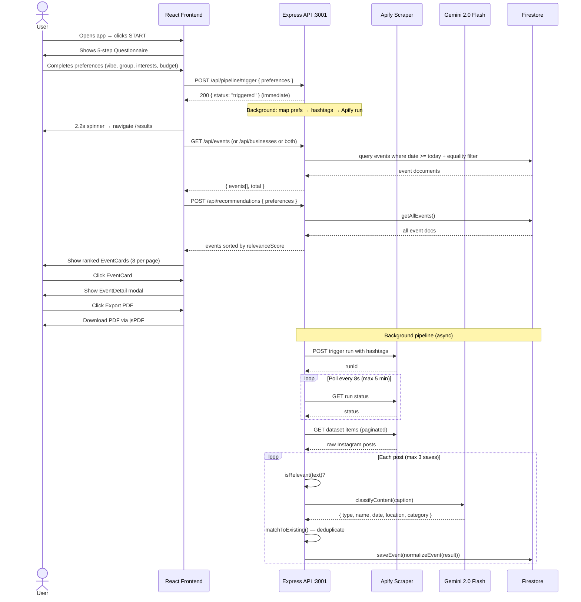
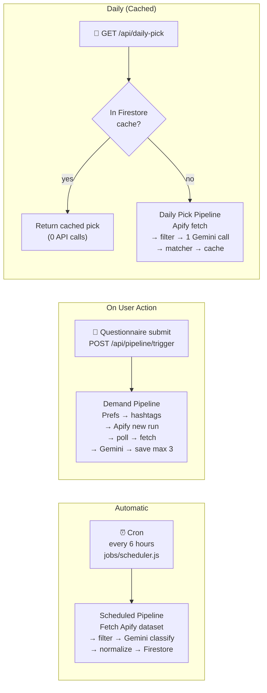

# Explore NYC — How the Project Works

```mermaid
flowchart TD

    %% ═══════════════════════════════════════════════════
    %% USER JOURNEY (Frontend)
    %% ═══════════════════════════════════════════════════

    subgraph BROWSER["🌐 Browser — React 19 + Vite + TailwindCSS"]
        direction TB

        START["StartScreen /\n'EXPLORE NYC'\nDiscover local events & pop-ups"]

        subgraph QUEST["Questionnaire /questionnaire · 5 Steps"]
            Q1["Step 1: What are you looking for?\nevents · local-business · both"]
            Q2["Step 2: What's your vibe?\n9 multi-select options\n(Outdoors, Arts, Gaming…)"]
            Q3["Step 3: Who are you with?\nSolo · Friends · Couple · Family"]
            Q4["Step 4: Your interests?\nText input + 12 predefined tags"]
            Q5["Step 5: Budget?\nFree · ≤$20 · ≤$50 · Any"]
            Q1 --> Q2 --> Q3 --> Q4 --> Q5
        end

        subgraph RESULTS["ResultsPage /results"]
            SCORE["scoreEvents()\nvibe keywords +3pts\ngroup type +2pts\ninterests +2pts\nprice match +1-3pts"]
            FILTER_UI["FilterScreen\nsearch · date range\ntime range · price"]
            PAGINATION["8 cards per page"]
            CARD["EventCard\ncategory color-coded\nname · date · location\nfree/paid badge · score dots"]
            MODAL["EventDetail modal\nfull info + Set Reminder\n(Firestore TODO)"]
            PDF["exportToPDF()\njsPDF library"]
            SCORE --> FILTER_UI --> PAGINATION --> CARD --> MODAL
            PAGINATION --> PDF
        end

        subgraph STUBS["Other Pages"]
            ABOUT["/about"]
            REVIEW["/reviews"]
            SUBMIT["/submit"]
        end

        START -->|"START button"| QUEST
        Q5 -->|"2.2s spinner\nsessionStorage save"| RESULTS
    end

    %% ═══════════════════════════════════════════════════
    %% API CLIENT LAYER
    %% ═══════════════════════════════════════════════════

    subgraph API_CLIENT["src/api/backend.ts — apiFetch wrapper"]
        AF1["fetchEvents(params)\nGET /api/events\n?search &date &category &is_free"]
        AF2["fetchBusinesses()\nGET /api/businesses"]
        AF3["fetchRecommendations(prefs)\nPOST /api/recommendations"]
        AF4["fetchDailyPick()\nGET /api/daily-pick"]
        AF5["triggerPipeline(prefs)\nPOST /api/pipeline/trigger\nfire-and-forget"]
    end

    %% ═══════════════════════════════════════════════════
    %% EXPRESS SERVER
    %% ═══════════════════════════════════════════════════

    subgraph SERVER["⚙️ Express Server · server.js · PORT 3001"]
        direction TB
        MW["Middleware Stack\nhelmet() → cors(allowlist) → express.json(10kb)\nglobalLimiter → recommendationsLimiter"]

        subgraph ROUTES["Routes"]
            RT1["GET /api/events\nroutes/events.js\nsearch·date·time·category·is_free"]
            RT2["GET /api/businesses\nroutes/businesses.js\nsearch·category"]
            RT3["POST /api/recommendations\nroutes/recommendations.js\n{ preferences }"]
            RT4["GET /api/daily-pick\nGET /api/daily-pick/week\nroutes/daily-pick.js"]
            RT5["POST /api/pipeline/trigger\nroutes/pipeline.js\nResponds 200 immediately"]
            RT6["GET /api/health"]
        end

        MW --> ROUTES
    end

    %% ═══════════════════════════════════════════════════
    %% SERVICES LAYER
    %% ═══════════════════════════════════════════════════

    subgraph SERVICES["Services — Business Logic"]
        SVC1["events.service.js\nqueryEvents(filters)\n· 1 equality filter → Firestore\n· remaining filters in-memory\n· hide is_legitimate===false\ngetEventById(id)\ngetAllEvents()"]

        SVC2["recommendations scoring (inline)\nVIBE_KEYWORDS map\nGROUP_KEYWORDS map\nsort by relevanceScore DESC"]

        SVC3["daily-pick.service.js\ngetDailyPick()\n· Firestore cache hit → return\n· cache miss → pipeline\n· 1 Gemini call then stop\n· cache in daily_picks/YYYY-MM-DD\ngetWeeklyPicks() → 7-day window"]

        SVC4["demand-pipeline.service.js\npreferencesToHashtags()\ntriggerApifyRun(hashtags)\nwaitForRun(runId) — polls 8s·max5min\nfetchDataset(datasetId) — paginated\nprocessPosts() — max 3 saves"]

        SVC5["pipeline.service.js\nScheduled pipeline wrapper\nrunPipeline()"]

        SVC6["startup-check.service.js\nrunStartupChecks() on boot\nverifies DB + API connectivity"]

        SVC7["business-checker.service.js\nvalidateLegitimacyBatch()\nflags spam / closed venues"]
    end

    %% ═══════════════════════════════════════════════════
    %% PROCESSORS
    %% ═══════════════════════════════════════════════════

    subgraph PROC["Processors — Data Transformations"]
        P1["filter.processor.js\nisRelevant(text)\nkeyword gate: event·tickets\nRSVP·join·location"]
        P2["event.processor.js\nnormalizeEvent(aiResult)\nGemini output → DB schema\ntitle·date·category·location·source"]
        P3["matcher.processor.js\nmatchToExisting(aiResult)\ndeduplication against\nexisting Firestore events"]
    end

    %% ═══════════════════════════════════════════════════
    %% AI LAYER
    %% ═══════════════════════════════════════════════════

    subgraph AI["🤖 AI Layer — ai/gemini.service.js"]
        GEM1["classifyContent(text)\nParses Instagram caption\n→ { type, name, date, location, category }"]
        GEM2["validateLegitimacyBatch(items[])\nBatch check: real vs spam/closed/fake\n→ { is_legitimate, confidence, reason }[]"]
        GEM3["validateLegitimacy(item)\nSingle-item wrapper for batch"]
        GEM3 --> GEM2
    end

    %% ═══════════════════════════════════════════════════
    %% EXTERNAL SERVICES
    %% ═══════════════════════════════════════════════════

    subgraph EXTERNAL["☁️ External APIs"]
        GEMINI_API["Gemini 2.0 Flash\ngenerationConfig:\ntemperature=0\nmaxOutputTokens=200\nRequires: GEMINI_API_KEY"]

        APIFY_API["Apify Instagram Scraper\napify~instagram-hashtag-scraper\nFree tier: 5 runs/month\nNYC hashtags · location tags\nRequires: APIFY_TOKEN"]
    end

    %% ═══════════════════════════════════════════════════
    %% DATABASE
    %% ═══════════════════════════════════════════════════

    subgraph DATABASE["🔥 Firebase Firestore — Free Tier"]
        FS1["Collection: events\nID: {name}-{date} deterministic\nFields: name·date·time·description\ncategory·is_free·min_price·max_price\nlocation·link·tags[]·group_type[]\ncompany_hosted·is_legitimate\nexperience_type·operating_hours"]
        FS2["Collection: daily_picks\nID: YYYY-MM-DD\nCached once per day\nNo repeat API calls"]
        FS3["Firebase Admin SDK\nGOOGLE_APPLICATION_CREDENTIALS\nFIREBASE_PROJECT_ID"]
        FS3 --> FS1
        FS3 --> FS2
    end

    %% ═══════════════════════════════════════════════════
    %% SCHEDULED JOB
    %% ═══════════════════════════════════════════════════

    subgraph CRON["⏰ Scheduled Jobs"]
        SCHED["jobs/scheduler.js\nnode-cron: 0 */6 * * *\n(every 6 hours)"]
    end

    %% ═══════════════════════════════════════════════════
    %% CONNECTIONS — Frontend ↔ Backend
    %% ═══════════════════════════════════════════════════

    RESULTS -->|"fetch on mount"| AF1
    RESULTS -->|"lookingFor=business"| AF2
    RESULTS -->|"POST preferences"| AF3
    Q5      -->|"fire-and-forget"| AF5

    AF1 --> RT1
    AF2 --> RT2
    AF3 --> RT3
    AF4 --> RT4
    AF5 --> RT5

    %% Routes → Services
    RT1 --> SVC1
    RT2 --> SVC1
    RT3 --> SVC2
    RT4 --> SVC3
    RT5 -->|"background async"| SVC4

    %% Scheduled → Pipeline Service
    SCHED --> SVC5

    %% Services → Processors
    SVC4 --> P1
    SVC4 --> P2
    SVC4 --> P3
    SVC5 --> P1
    SVC5 --> P2
    SVC3 --> P1
    SVC3 --> P2
    SVC3 --> P3

    %% Services → AI
    SVC4 --> GEM1
    SVC5 --> GEM1
    SVC3 --> GEM1
    SVC7 --> GEM2

    %% AI → External
    GEM1 --> GEMINI_API
    GEM2 --> GEMINI_API

    %% Pipelines → Apify
    SVC4 --> APIFY_API
    SVC5 --> APIFY_API
    SVC3 --> APIFY_API

    %% Services → Database
    SVC1 --> FS1
    SVC2 --> FS1
    SVC3 --> FS1
    SVC3 --> FS2
    SVC4 --> FS1
    SVC5 --> FS1

    %% ═══════════════════════════════════════════════════
    %% STYLING
    %% ═══════════════════════════════════════════════════

    classDef frontend  fill:#1a472a,stroke:#52b788,color:#fff
    classDef apiClient fill:#2d4a6b,stroke:#5b9bd5,color:#fff
    classDef server    fill:#3b3b6b,stroke:#7b7bdb,color:#fff
    classDef service   fill:#4a2060,stroke:#9b5fc0,color:#fff
    classDef processor fill:#5a2020,stroke:#c05f5f,color:#fff
    classDef ai        fill:#7a4010,stroke:#e08030,color:#fff
    classDef external  fill:#3a3a3a,stroke:#888,color:#fff
    classDef db        fill:#0d3b6e,stroke:#3a87d4,color:#fff
    classDef cron      fill:#2a4a2a,stroke:#5a9a5a,color:#fff

    class START,QUEST,RESULTS,STUBS,Q1,Q2,Q3,Q4,Q5,SCORE,FILTER_UI,PAGINATION,CARD,MODAL,PDF,ABOUT,REVIEW,SUBMIT frontend
    class AF1,AF2,AF3,AF4,AF5 apiClient
    class MW,RT1,RT2,RT3,RT4,RT5,RT6 server
    class SVC1,SVC2,SVC3,SVC4,SVC5,SVC6,SVC7 service
    class P1,P2,P3 processor
    class GEM1,GEM2,GEM3 ai
    class GEMINI_API,APIFY_API external
    class FS1,FS2,FS3,DATABASE db
    class SCHED cron
```

---

## Full User Journey

```mermaid
sequenceDiagram
    actor User
    participant FE as React Frontend
    participant BE as Express API :3001
    participant Apify as Apify Scraper
    participant Gemini as Gemini 2.0 Flash
    participant FS as Firestore

    User->>FE: Opens app → clicks START
    FE->>User: Shows 5-step Questionnaire

    User->>FE: Completes preferences (vibe, group, interests, budget)
    FE->>BE: POST /api/pipeline/trigger { preferences }
    BE-->>FE: 200 { status: "triggered" } (immediate)
    Note over BE: Background: map prefs → hashtags → Apify run

    FE->>User: 2.2s spinner → navigate /results

    FE->>BE: GET /api/events (or /api/businesses or both)
    BE->>FS: query events where date >= today + equality filter
    FS-->>BE: event documents
    BE-->>FE: { events[], total }

    FE->>BE: POST /api/recommendations { preferences }
    BE->>FS: getAllEvents()
    FS-->>BE: all event docs
    BE-->>FE: events sorted by relevanceScore

    FE->>User: Show ranked EventCards (8 per page)

    User->>FE: Click EventCard
    FE->>User: Show EventDetail modal

    User->>FE: Click Export PDF
    FE->>User: Download PDF via jsPDF

    Note over BE,FS: Background pipeline (async)
    BE->>Apify: POST trigger run with hashtags
    Apify-->>BE: runId
    loop Poll every 8s (max 5 min)
        BE->>Apify: GET run status
        Apify-->>BE: status
    end
    BE->>Apify: GET dataset items (paginated)
    Apify-->>BE: raw Instagram posts
    loop Each post (max 3 saves)
        BE->>BE: isRelevant(text)?
        BE->>Gemini: classifyContent(caption)
        Gemini-->>BE: { type, name, date, location, category }
        BE->>BE: matchToExisting() — deduplicate
        BE->>FS: saveEvent(normalizeEvent(result))
    end
```

---

## Pipeline Triggers

```mermaid
flowchart LR
    subgraph AUTO["Automatic"]
        C1["⏰ Cron\nevery 6 hours\njobs/scheduler.js"] --> P1["Scheduled Pipeline\nFetch Apify dataset\n→ filter → Gemini classify\n→ normalize → Firestore"]
    end

    subgraph ON_DEMAND["On User Action"]
        C2["👤 Questionnaire submit\nPOST /api/pipeline/trigger"] --> P2["Demand Pipeline\nPrefs → hashtags\n→ Apify new run\n→ poll → fetch\n→ Gemini → save max 3"]
    end

    subgraph DAILY["Daily (Cached)"]
        C3["📅 GET /api/daily-pick"] --> CHK{"In Firestore\ncache?"}
        CHK -->|yes| RET["Return cached pick\n(0 API calls)"]
        CHK -->|no| P3["Daily Pick Pipeline\nApify fetch\n→ filter → 1 Gemini call\n→ matcher → cache"]
    end
```
