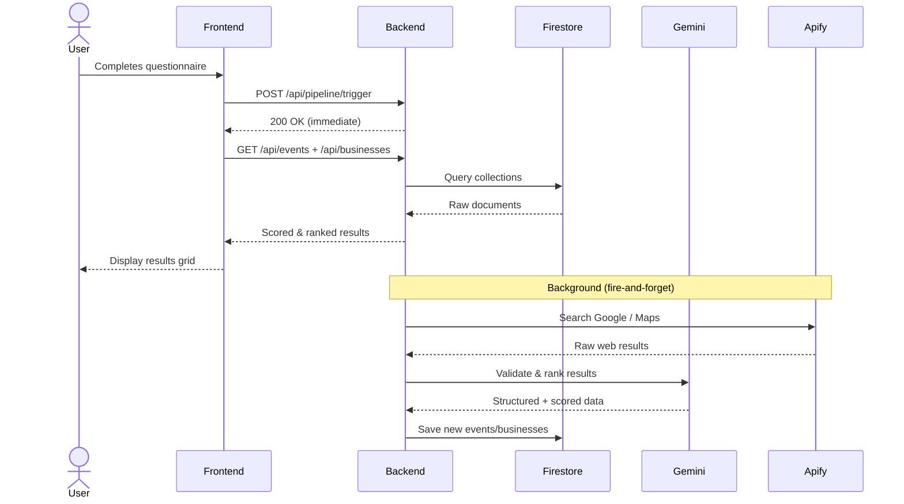

# Explore NYC

> AI-powered event & opportunity discovery for New York City  
> Built for **GDG CityTech Solution Challenger 2026**

**Explore NYC** is a full-stack web application that helps users discover local events, pop-ups, hidden gems, and professional opportunities in New York City. Users answer a short questionnaire and an AI-powered pipeline finds, validates, and ranks the best matches — in real time.

---

## Repository Structure

```
GDG-CityTech-SolutionChallenger-2026/
├── Explore-NYC/        ← React 19 + TypeScript frontend (Vite + TailwindCSS)
├── backend/            ← Node.js + Express API (Firestore + Gemini + Apify)
├── default-data/       ← JSON seed data for Firestore collections
└── ARCHITECTURE.md     ← Full system architecture & mermaid diagrams
```

Each service has its own setup guide:

- **Frontend** → [`Explore-NYC/README.md`](Explore-NYC/README.md)
- **Backend** → [`backend/Readme.md`](backend/Readme.md)
- **Seed Data** → [`default-data/README.md`](default-data/README.md)

Start the backend first, then the frontend.

---

## System Overview

```mermaid
graph TB
    subgraph Client["Frontend — React 19 + TypeScript"]
        A[StartScreen] --> B[Questionnaire\n5-step form]
        B --> C[ResultsPage\n8-per-page grid]
        B --> D[EducationQuestionnaire\n5-step form]
        D --> E[EducationResults\nOrg cards]
        C --> F[EventDetail Modal]
        C --> G[PDF Export]
        E --> G
    end

    subgraph API["Backend — Express 4 on :3001"]
        H[/api/events]
        I[/api/businesses]
        J[POST /api/recommendations]
        K[POST /api/pipeline/trigger]
        L[/api/daily-pick]
        M[/api/education]
        N[/api/health]
    end

    subgraph Pipeline["Data Pipeline"]
        O[demand-pipeline.service\nuser-triggered, fire-and-forget]
        P[pipeline.service\ncron every 6 hours]
        Q[daily-pick.service\ncached once per day]
    end

    subgraph External["External Services"]
        R[Google Gemini 2.0 Flash\nAI validation & ranking]
        S[Apify\nGoogle Search · Maps · Instagram]
        T[Google Firestore\nNoSQL database]
    end

    B -- "POST /api/pipeline/trigger\n(fire & forget)" --> K
    C -- GET --> H
    C -- GET --> I
    C -- POST --> J
    D -- POST --> M
    A -- GET --> L

    K --> O
    P --> P
    L --> Q

    O --> S
    O --> R
    P --> S
    P --> R
    Q --> S
    Q --> R

    O --> T
    P --> T
    Q --> T
    H --> T
    I --> T
    J --> T
    M --> T
```

---

## Two Modes

### NYC Explorer
Users discover events and local businesses matched to their vibe, group type, interests, and budget. A background AI pipeline enriches results after submission.

### High Education
Users (high school, college, career changers) discover professional programs, events, and job opportunities matched to their focus area and experience level.

---

## Tech Stack

| Layer | Technology |
|---|---|
| Frontend | React 19, TypeScript, Vite, TailwindCSS v4 |
| Routing | React Router v7 |
| Backend | Node.js 18+, Express 4, ESM modules |
| Database | Google Firestore (Firebase Free Tier) |
| AI | Google Gemini 2.0 Flash |
| Scraping | Apify (Google Search, Google Maps, Instagram) |
| Maps | @vis.gl/react-google-maps |
| PDF Export | jsPDF |
| Cron | node-cron |
| Security | Helmet, express-rate-limit, CORS allowlist |

---

## Quick Start

### Prerequisites

- Node.js 18+
- Firebase project with Firestore enabled
- Firebase Admin SDK service account JSON
- Gemini API key
- Apify token

### 1. Clone & configure

```bash
git clone <repo-url>
cd GDG-CityTech-SolutionChallenger-2026
```

### 2. Start the backend

```bash
cd backend
cp .env.example .env        # fill in Firebase, Gemini, Apify credentials
npm install
npm run seed                 # load default-data/ into Firestore (run once)
npm run dev                  # starts on http://localhost:3001
```

### 3. Start the frontend

```bash
cd ../Explore-NYC
npm install
npm run dev                  # starts on http://localhost:5173
```

Open [http://localhost:5173](http://localhost:5173).

---

## Data Flow



---

## Environment Variables

Copy `backend/.env.example` and fill in:

```env
GOOGLE_APPLICATION_CREDENTIALS=./database/YOUR-adminsdk.json
FIREBASE_PROJECT_ID=your-firebase-project-id
GEMINI_API_KEY=your-gemini-api-key
APIFY_TOKEN=your-apify-token
PORT=3001
ALLOWED_ORIGINS=http://localhost:5173
```

---

## Team

- Osumane
- Yuzhen
- Catherine

## License

MIT
