# Backend Architecture — Explore NYC

## System Overview

```mermaid
flowchart TD

    subgraph TRIGGERS["Triggers"]
        CRON["⏰ Cron Job\nnode-cron · every 6 hours\njobs/scheduler.js"]
        USER["👤 User submits\nQuestionnaire\nPOST /api/pipeline/trigger"]
        HTTP["🌐 Frontend\nHTTP Requests"]
        SEED["🌱 npm run seed\ndatabase/seed.js"]
    end

    subgraph SERVER["Express Server · server.js · PORT 3001"]
        MW["helmet() → cors(allowlist) → express.json(10kb)\nglobalLimiter → recommendationsLimiter"]

        subgraph ROUTES["Routes"]
            R_EVENTS["GET /api/events\nroutes/events.js"]
            R_BIZ["GET /api/businesses\nroutes/businesses.js"]
            R_RECO["POST /api/recommendations\nroutes/recommendations.js"]
            R_DAILY["GET /api/daily-pick  /week\nroutes/daily-pick.js"]
            R_PIPE["POST /api/pipeline/trigger\nroutes/pipeline.js"]
            R_EDU["GET /api/education\nPOST /api/education/recommendations\nroutes/education.js"]
            R_HEALTH["GET /api/health"]
        end

        MW --> ROUTES
    end

    subgraph PIPELINES["Data Pipelines — Events & Businesses"]
        direction TB

        subgraph SCHEDULED["Scheduled Pipeline\nservices/pipeline.service.js"]
            SP1["fetchInstagramPosts()\nscrapers/apify.scraper.js"]
            SP2["isRelevant(text)\nfilter.processor.js"]
            SP3["classifyContent(text)\ngemini.service.js"]
            SP4["normalizeEvent()\nevent.processor.js"]
            SP5["saveEvent()\nfirestore.js"]
            SP1 --> SP2 --> SP3 --> SP4 --> SP5
        end

        subgraph DEMAND["Demand Pipeline\nservices/demand-pipeline.service.js"]
            DP0["preferencesToHashtags(prefs)\nMaps vibe + interests → hashtags"]
            DP1["triggerApifyRun(hashtags)\nPOST apify~instagram-hashtag-scraper"]
            DP2["waitForRun(runId)\nPolls every 8s · max 5 min"]
            DP3["fetchDataset(datasetId)\nPaginated"]
            DP4["isRelevant(text)"]
            DP5["classifyContent(text)"]
            DP6["matchToExisting(aiResult)\nmatcher.processor.js"]
            DP7["saveEvent(normalizeEvent())\nMax 3 events per run"]
            DP0 --> DP1 --> DP2 --> DP3 --> DP4 --> DP5 --> DP6 --> DP7
        end

        subgraph DAILY["Daily Pick\nservices/daily-pick.service.js"]
            DA1{"Firestore cache\ndaily_picks/today?"}
            DA2["fetchInstagramPosts()"]
            DA3["classifyContent() — 1 call then stop"]
            DA4["matchToExisting()"]
            DA5["Cache in daily_picks/YYYY-MM-DD"]
            DA6["saveEvent() if new"]
            DA1 -->|hit| CACHE_RET["Return cached pick"]
            DA1 -->|miss| DA2 --> DA3 --> DA4 --> DA5 --> DA6
        end
    end

    subgraph EDU_SVC["Education Service\nservices/education.service.js"]
        ES1["queryEducation(filters)\ntype · focusArea · search\nReads Firestore 'education' collection"]
        ES2["recommendEducation(prefs)\nlookingFor · focusArea · experienceYears · extraSearch\nScores: focusArea +5 · experience +4 · keyword +3"]
    end

    subgraph SEED_SVC["Seed Script\ndatabase/seed.js"]
        SD1["seedEvents()\ndefault-data/events.json → Firestore events"]
        SD2["seedBusinesses()\ndefault-data/local-business.json → Firestore businesses"]
        SD3["seedEducation()\ndefault-data/Professional-Education.json\n→ Firestore education\ntype: event | job"]
    end

    subgraph QUERY_SVC["Query Services"]
        SVC1["events.service.js\nqueryEvents(filters) · getEventById() · getAllEvents()\n1 equality filter → Firestore · rest in-memory\nhide is_legitimate===false"]
        SVC2["recommendations.js (inline)\nVIBE_KEYWORDS · GROUP_KEYWORDS\nrelevanceScore sort DESC"]
        SVC3["daily-pick.service.js\ngetDailyPick() · getWeeklyPicks()"]
        SVC4["demand-pipeline.service.js"]
        SVC5["pipeline.service.js · runPipeline()"]
        SVC6["startup-check.service.js\nrunStartupChecks() on boot"]
        SVC7["business-checker.service.js\nvalidateLegitimacyBatch()"]
    end

    subgraph PROC["Processors"]
        P1["filter.processor.js\nisRelevant(text)"]
        P2["event.processor.js\nnormalizeEvent(aiResult)"]
        P3["matcher.processor.js\nmatchToExisting(aiResult)"]
    end

    subgraph AI["AI Layer · ai/gemini.service.js"]
        GEM1["classifyContent(text)\n→ { type, name, date, location, category }"]
        GEM2["validateLegitimacyBatch(items[])\n→ { is_legitimate, confidence, reason }[]"]
        GEM3["validateLegitimacy(item) — single-item wrapper"]
        GEM3 --> GEM2
        GEM1 --> GEMINI_EXT
        GEM2 --> GEMINI_EXT
    end

    subgraph EXTERNAL["External APIs"]
        GEMINI_EXT["Gemini 2.0 Flash\ntemp=0 · maxTokens=200\nGEMINI_API_KEY"]
        APIFY_EXT["Apify Instagram Scraper\napify~instagram-hashtag-scraper\nFree tier: 5 runs/month\nAPIFY_TOKEN"]
    end

    subgraph DB["Firebase Firestore — Free Tier\ndatabase/firestore.js"]
        FS1["Collection: events\nID: {name}-{date}\nname·date·time·description·category\nis_free·min_price·max_price·location\nlink·tags[]·group_type[]·is_legitimate"]
        FS2["Collection: businesses\nID: {name-slug}\nname·description·hours·location\ncategory·link·is_active"]
        FS3["Collection: daily_picks\nID: YYYY-MM-DD · cached once/day"]
        FS4["Collection: education\nID: {org-name-slug}\ntype: event|job · name · focusArea\nrequirement · services[] · otherCategory\nregistrationLink · dueDate"]
        FSI["Firebase Admin SDK\nGOOGLE_APPLICATION_CREDENTIALS\nFIREBASE_PROJECT_ID"]
        FSI --> FS1
        FSI --> FS2
        FSI --> FS3
        FSI --> FS4
    end

    subgraph CRON_JOB["Scheduled Jobs"]
        SCHED["jobs/scheduler.js\nnode-cron: 0 */6 * * *"]
    end

    %% Triggers
    HTTP --> MW
    USER --> R_PIPE
    CRON_JOB --> SVC5
    SCHED --> CRON_JOB
    SEED --> SD1 & SD2 & SD3

    %% Seed → DB
    SD1 --> FS1
    SD2 --> FS2
    SD3 --> FS4

    %% Routes → Services
    R_EVENTS --> SVC1
    R_BIZ    --> SVC1
    R_RECO   --> SVC2
    R_DAILY  --> SVC3
    R_PIPE   -->|"fire-and-forget"| SVC4
    R_EDU    --> ES1 & ES2

    %% Services → DB
    SVC1 --> FS1
    SVC2 --> FS1
    SVC3 --> FS1 & FS3
    SVC4 --> FS1
    SVC5 --> FS1
    ES1  --> FS4
    ES2  --> FS4

    %% Pipelines → External
    SVC4 --> APIFY_EXT
    SVC5 --> APIFY_EXT
    SVC3 --> APIFY_EXT

    %% Pipelines → AI
    SVC4 --> GEM1
    SVC5 --> GEM1
    SVC3 --> GEM1
    SVC7 --> GEM2

    %% Pipelines → Processors
    SVC4 --> P1 & P2 & P3
    SVC5 --> P1 & P2
    SVC3 --> P1 & P2 & P3

    %% Styling
    classDef trigger  fill:#3a3a3a,stroke:#888,color:#fff
    classDef route    fill:#1a4a2f,stroke:#4a9a6f,color:#fff
    classDef service  fill:#3a1a5a,stroke:#8a5aaa,color:#fff
    classDef eduSvc   fill:#0d2b4a,stroke:#4A9EE0,color:#fff
    classDef pipeline fill:#4a2a00,stroke:#aa7a30,color:#fff
    classDef proc     fill:#4a1a1a,stroke:#aa4a4a,color:#fff
    classDef ai       fill:#5a3000,stroke:#c07020,color:#fff
    classDef db       fill:#0a2a5a,stroke:#3a7ad4,color:#fff
    classDef eduDb    fill:#0d2b4a,stroke:#4A9EE0,color:#fff
    classDef external fill:#2a2a2a,stroke:#777,color:#fff
    classDef seed     fill:#1a3a1a,stroke:#4a8a4a,color:#fff

    class CRON,USER,HTTP,SEED trigger
    class R_EVENTS,R_BIZ,R_RECO,R_DAILY,R_PIPE,R_EDU,R_HEALTH route
    class SVC1,SVC2,SVC3,SVC4,SVC5,SVC6,SVC7 service
    class ES1,ES2 eduSvc
    class SP1,SP2,SP3,SP4,SP5,DP0,DP1,DP2,DP3,DP4,DP5,DP6,DP7,DA1,DA2,DA3,DA4,DA5,DA6 pipeline
    class P1,P2,P3 proc
    class GEM1,GEM2,GEM3 ai
    class FS1,FS2,FS3 db
    class FS4 eduDb
    class GEMINI_EXT,APIFY_EXT external
    class SD1,SD2,SD3 seed
```



---

## Data Flow Summary

### 1 — Scheduled Pipeline (every 6 hours)
```
node-cron → pipeline.service.js → Apify (fetch cached dataset)
  → filter.processor (isRelevant) → gemini.service (classifyContent)
  → event.processor (normalize) → Firestore: events
```

### 2 — Demand Pipeline (user questionnaire submit)
```
POST /api/pipeline/trigger → HTTP 200 immediately
  → demand-pipeline.service.js (background async)
  → preferencesToHashtags → Apify (trigger new run) → poll every 8s (max 5 min)
  → fetchDataset (paginated) → filter → Gemini classify → matcher (dedupe)
  → normalizeEvent → Firestore: events  (max 3 new events per run)
```

### 3 — Daily Pick (cached once per day)
```
GET /api/daily-pick → daily-pick.service.js
  → Firestore: daily_picks/today  (cache hit → return immediately, 0 API calls)
  → (cache miss) Apify fetch → filter → Gemini (1 call then stop)
  → matcher → cache in daily_picks → saveEvent if new
```

### 4 — Events / Businesses Query
```
GET /api/events?category=&date=&is_free=&search= → events.service.js
  → Firestore: 1 equality filter pushed to DB (free-tier index limit)
  → remaining filters applied in-memory
  → hide events where is_legitimate === false
```

### 5 — Recommendations Scoring
```
POST /api/recommendations { preferences } → recommendations.js (inline scoring)
  → getAllEvents() from Firestore
  → score: vibe keywords +3 · group type +2 · interests +2 · price +1–3
  → sort DESC by relevanceScore → return ranked list
```

### 6 — Education Query
```
GET /api/education?type=event|job|both&focusArea=Technology&search=bootcamp
  → education.service.js → Firestore: education collection
  → in-memory filter by type · focusArea · search keyword
```

### 7 — Education Recommendations
```
POST /api/education/recommendations { preferences }
  → education.service.js → recommendEducation(prefs)
  → Firestore: education collection (all docs)
  → filter by lookingFor (event | job | both)
  → score: focusArea match +5 · experience fit +4 · keyword match +3
  → sort DESC by relevanceScore → return ranked list
```

### 8 — Seed
```
npm run seed → database/seed.js
  → seedEvents()      default-data/events.json              → Firestore: events
  → seedBusinesses()  default-data/local-business.json      → Firestore: businesses
  → seedEducation()   default-data/Professional-Education.json → Firestore: education
                      (type: event | job per entry)
```
