# Backend Architecture — Explore NYC

## System Overview

```mermaid
flowchart TD
    subgraph TRIGGERS["Triggers"]
        CRON["⏰ Cron Job\nnode-cron · every 6 hours\njobs/scheduler.js"]
        USER["👤 User submits\nQuestionnaire\nPOST /api/pipeline/trigger"]
        HTTP["🌐 Frontend\nHTTP Requests"]
    end

    subgraph SERVER["Express Server · server.js"]
        HELMET["helmet() — security headers"]
        CORS["cors() — origin allowlist"]
        RLIMIT["globalLimiter + recommendationsLimiter\nconfig/rateLimiter.js"]

        subgraph ROUTES["Routes"]
            R_EVENTS["/api/events\nroutes/events.js"]
            R_RECO["/api/recommendations\nroutes/recommendations.js"]
            R_DAILY["/api/daily-pick\nroutes/daily-pick.js"]
            R_PIPE["/api/pipeline/trigger\nroutes/pipeline.js"]
            R_HEALTH["/api/health"]
        end
    end

    subgraph PIPELINES["Data Pipelines"]
        direction TB

        subgraph SCHEDULED["Scheduled Pipeline\nservices/pipeline.service.js"]
            SP1["1. fetchInstagramPosts()\nscrapers/apify.scraper.js"]
            SP2["2. isRelevant(post.text)\nprocessors/filter.processor.js"]
            SP3["3. classifyContent(text)\nai/gemini.service.js"]
            SP4["4. normalizeEvent(aiResult)\nprocessors/event.processor.js"]
            SP5["5. saveEvent(event)\ndatabase/firestore.js"]
            SP1 --> SP2 --> SP3 --> SP4 --> SP5
        end

        subgraph DEMAND["Demand Pipeline (user-triggered)\nservices/demand-pipeline.service.js"]
            DP0["preferencesToHashtags(preferences)\nMaps vibe + interests → #nycevents hashtags"]
            DP1["triggerApifyRun(hashtags)\nPOST apify~instagram-hashtag-scraper"]
            DP2["waitForRun(runId)\nPolls every 8s · max 5 min"]
            DP3["fetchDataset(datasetId)\nPaginates Apify dataset"]
            DP4["isRelevant(post.text)\nprocessors/filter.processor.js"]
            DP5["classifyContent(text)\nai/gemini.service.js"]
            DP6["matchToExisting(aiResult)\nprocessors/matcher.processor.js"]
            DP7["saveEvent(normalizeEvent(aiResult))\nMax 3 new events per run"]
            DP0 --> DP1 --> DP2 --> DP3 --> DP4 --> DP5 --> DP6 --> DP7
        end

        subgraph DAILY["Daily Pick\nservices/daily-pick.service.js"]
            DA1["Check Firestore cache\ndaily_picks/YYYY-MM-DD"]
            DA2["fetchInstagramPosts()\nApify dataset read"]
            DA3["classifyContent(text)\n1 Gemini call then stop"]
            DA4["matchToExisting(aiResult)\nprocessors/matcher.processor.js"]
            DA5["Cache pick in Firestore\ndaily_picks collection"]
            DA6["saveEvent() if new event"]
            DA1 -->|"miss"| DA2 --> DA3 --> DA4 --> DA5 --> DA6
            DA1 -->|"hit"| RETURN_CACHE["Return cached pick"]
        end
    end

    subgraph AI["AI Layer · ai/gemini.service.js"]
        GEM_CLASS["classifyContent(text)\nReturns: type, name, date,\nlocation, category"]
        GEM_VALID["validateLegitimacyBatch(items)\nBatch legitimacy check"]
        GEM_SINGLE["validateLegitimacy(item)\nSingle-item wrapper"]
        GEM_SINGLE --> GEM_VALID
        GEMINI_API["Gemini 2.0 Flash API\ngenerationConfig: temp=0, maxTokens=200"]
        GEM_CLASS --> GEMINI_API
        GEM_VALID --> GEMINI_API
    end

    subgraph APIFY["Scraping Layer · scrapers/apify.scraper.js"]
        APIFY_API["Apify Instagram Scraper\napify~instagram-hashtag-scraper\nFree tier: 5 runs/month"]
        RAW["Raw posts\ncaption, metadata, images"]
        APIFY_API --> RAW
    end

    subgraph PROCESSORS["Processors"]
        FILTER["filter.processor.js\nisRelevant(text)\nKeyword + noise filter"]
        NORMALIZER["event.processor.js\nnormalizeEvent(aiResult)\nMaps AI output → DB schema"]
        MATCHER["matcher.processor.js\nmatchToExisting(aiResult)\nDeduplication against existing events"]
    end

    subgraph DB["Database · database/firestore.js"]
        FS_EVENTS["Firestore Collection: events\nFree tier · ~50k reads/day"]
        FS_DAILY["Firestore Collection: daily_picks\nKeyed by YYYY-MM-DD"]
        SCHEMA["database/schemas/event.schema.js\nEVENT_COLLECTION constant\nField definitions"]
    end

    subgraph SERVICES["Query Services"]
        SVC_EVENTS["events.service.js\nqueryEvents(filters)\ngetEventById(id)\ngetAllEvents()"]
        SVC_RECO["recommendations.js (inline)\nKeyword scoring:\nVIBE_KEYWORDS · GROUP_KEYWORDS\nrelevanceScore sort"]
        SVC_BIZ["business-checker.service.js\nvalidateLegitimacyBatch()"]
        SVC_STARTUP["startup-check.service.js\nrunStartupChecks() on boot"]
    end

    %% Trigger connections
    CRON -->|"every 6h"| SCHEDULED
    USER -->|"POST /api/pipeline/trigger\nResponds immediately"| R_PIPE
    R_PIPE -->|"fire-and-forget background"| DEMAND
    HTTP --> SERVER

    %% Server middleware flow
    SERVER --> HELMET
    HELMET --> CORS
    CORS --> RLIMIT
    RLIMIT --> ROUTES

    %% Route → service connections
    R_EVENTS --> SVC_EVENTS
    R_RECO --> SVC_RECO
    R_DAILY --> DAILY
    SVC_EVENTS --> DB
    SVC_RECO --> SVC_EVENTS

    %% Pipeline → external
    SP1 --> APIFY_API
    DP1 --> APIFY_API
    DA2 --> APIFY_API

    %% Pipeline → AI
    SP3 --> GEM_CLASS
    DP5 --> GEM_CLASS
    DA3 --> GEM_CLASS

    %% Pipeline → processors
    SP2 --> FILTER
    DP4 --> FILTER
    SP4 --> NORMALIZER
    DP6 --> MATCHER
    DA4 --> MATCHER
    DP7 --> NORMALIZER

    %% Pipeline → DB
    SP5 --> FS_EVENTS
    DP7 --> FS_EVENTS
    DA5 --> FS_DAILY
    DA6 --> FS_EVENTS

    %% Services → DB
    SVC_EVENTS --> FS_EVENTS
    SVC_BIZ --> GEM_VALID

    %% Styling
    classDef trigger fill:#4a4a4a,stroke:#888,color:#fff
    classDef route fill:#2d6a4f,stroke:#52b788,color:#fff
    classDef pipeline fill:#6d4c8e,stroke:#b07cc6,color:#fff
    classDef ai fill:#8b4513,stroke:#d4872a,color:#fff
    classDef db fill:#1565c0,stroke:#42a5f5,color:#fff
    classDef processor fill:#4a235a,stroke:#9b59b6,color:#fff
    classDef external fill:#555,stroke:#999,color:#fff

    class CRON,USER,HTTP trigger
    class R_EVENTS,R_RECO,R_DAILY,R_PIPE,R_HEALTH route
    class SP1,SP2,SP3,SP4,SP5,DP0,DP1,DP2,DP3,DP4,DP5,DP6,DP7,DA1,DA2,DA3,DA4,DA5,DA6 pipeline
    class GEM_CLASS,GEM_VALID,GEM_SINGLE ai
    class FS_EVENTS,FS_DAILY,SCHEMA db
    class FILTER,NORMALIZER,MATCHER processor
    class APIFY_API,GEMINI_API external
```



---

## Data Flow Summary

### 1 — Scheduled Pipeline (every 6 hours)
```
node-cron → pipeline.service.js → Apify (fetch cached dataset)
  → filter.processor (isRelevant) → gemini.service (classifyContent)
  → event.processor (normalize) → Firestore events collection
```

### 2 — Demand Pipeline (user questionnaire)
```
POST /api/pipeline/trigger → [HTTP 200 immediately]
  → demand-pipeline.service.js (background)
  → preferencesToHashtags → Apify (trigger new run) → poll status
  → fetchDataset → filter → Gemini classify → matcher (dedupe)
  → normalizeEvent → Firestore (max 3 new events per run)
```

### 3 — Daily Pick (cached, once per day)
```
GET /api/daily-pick → daily-pick.service.js
  → Firestore daily_picks/{today} (cache hit → return)
  → (cache miss) Apify fetch → filter → Gemini (1 call, then stop)
  → matcher → cache in daily_picks → saveEvent if new
```

### 4 — Events Query
```
GET /api/events?category=&date=&is_free=&search= → events.service.js
  → Firestore: one equality filter pushed to DB (free-tier index limit)
  → remaining filters applied in-memory
  → strip events where is_legitimate === false
```

### 5 — Recommendations Scoring
```
POST /api/recommendations { preferences } → recommendations.js
  → getAllEvents() from Firestore
  → score each event: vibe keywords (+3) · group type (+2) · interests (+2) · price (+1–3)
  → sort descending by relevanceScore → return ranked list
```
