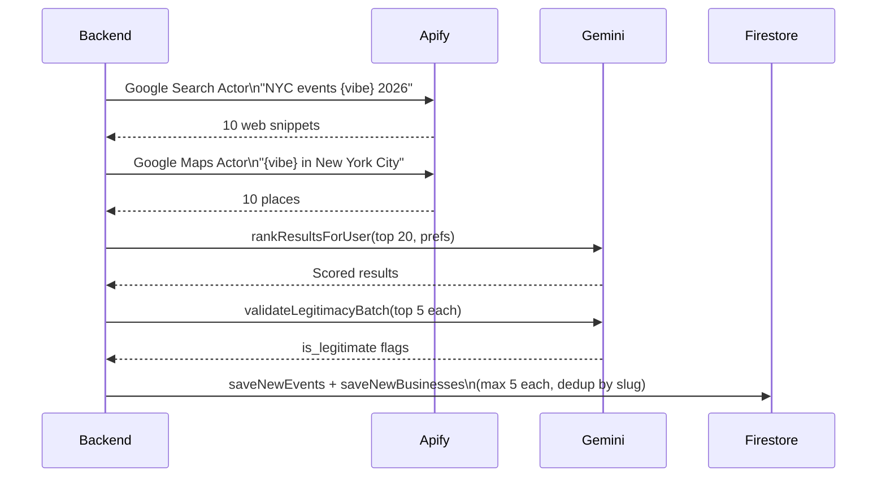
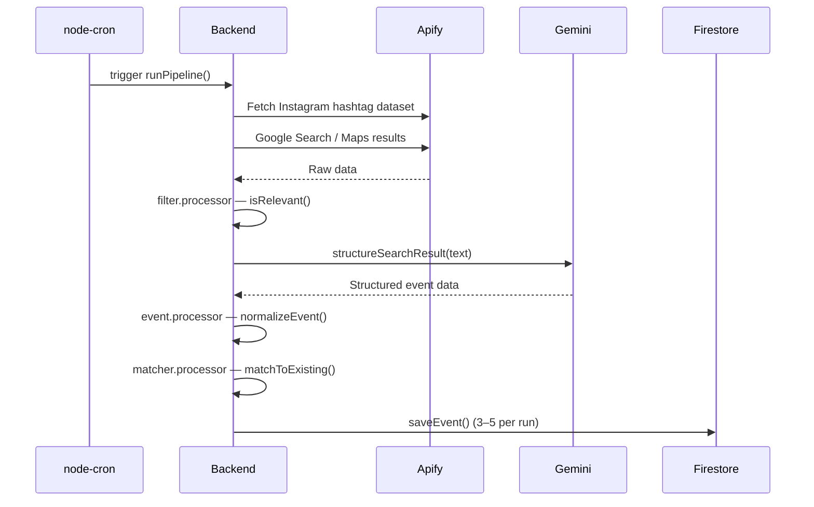

# Explore NYC — Backend API

Express.js REST API powering the Explore NYC application. Connects to **Google Firestore**, uses **Google Gemini 2.0 Flash** for AI content validation and ranking, and **Apify** for real-time web scraping.

---

## Architecture

```mermaid
graph TB
    subgraph Routes["Routes Layer"]
        R1[events.js]
        R2[businesses.js]
        R3[recommendations.js]
        R4[pipeline.js]
        R5[daily-pick.js]
        R6[education.js]
        R7[search.js]
        R8[suggestions.js]
        R9[map.js]
    end

    subgraph Services["Services Layer"]
        S1[events.service]
        S2[demand-pipeline.service\nuser-triggered]
        S3[pipeline.service\ncron-scheduled]
        S4[daily-pick.service\ncached per day]
        S5[education.service]
        S6[apify-search.service]
        S7[business-checker.service]
        S8[map.service]
    end

    subgraph AI["AI Layer"]
        A1[gemini.service\nvalidateLegitimacyBatch\nstructureSearchResult\nrankResultsForUser]
    end

    subgraph Processors["Processors"]
        P1[filter.processor\nisRelevant]
        P2[event.processor\nnormalizeEvent]
        P3[matcher.processor\nmatchToExisting]
    end

    subgraph Jobs["Scheduled Jobs"]
        J1[scheduler.js\nnode-cron every 6h]
    end

    subgraph DB["Database"]
        D1[(Firestore\nevents)]
        D2[(Firestore\nbusinesses)]
        D3[(Firestore\ndaily_picks)]
        D4[(Firestore\nprofessional_events)]
        D5[(Firestore\njobs_internships)]
    end

    subgraph External["External APIs"]
        E1[Apify\nGoogle Search Actor]
        E2[Apify\nGoogle Maps Actor]
        E3[Apify\nInstagram Actor]
        E4[Gemini 2.0 Flash]
    end

    R1 --> S1 --> D1
    R2 --> S1 --> D2
    R3 --> S1
    R4 --> S2
    R5 --> S4
    R6 --> S5 --> D4 & D5
    J1 --> S3

    S2 --> S6 --> E1 & E2
    S3 --> S6 & E3
    S4 --> E3

    S2 --> A1 --> E4
    S3 --> P1 & P2 & P3
    S3 --> A1
    S4 --> A1

    S2 --> D1 & D2
    S3 --> D1 & D2
    S4 --> D3
```



---

## Tech Stack

| Layer | Technology | Version |
|---|---|---|
| Runtime | Node.js (ESM modules) | 18+ |
| Framework | Express | 4.18.2 |
| Database | Google Firestore (Firebase Admin SDK) | 13.8.0 |
| AI | Google Generative AI (Gemini 2.0 Flash) | latest |
| Scraping | Apify Client | latest |
| Cron | node-cron | 4.2.1 |
| Rate Limiting | express-rate-limit | 8.3.2 |
| Security | Helmet | 8.1.0 |
| CORS | cors | 2.8.5 |
| Config | dotenv | 17.4.2 |

---

## Project Structure

```
backend/
├── server.js                       # Express entry point — route mounting, middleware, PORT 3001
├── package.json
├── .env                            # Secret config (NOT committed)
├── .env.example                    # Template — copy to .env
│
├── routes/
│   ├── events.js                   # GET /api/events, GET /api/events/:id
│   ├── businesses.js               # GET /api/businesses
│   ├── recommendations.js          # POST /api/recommendations
│   ├── pipeline.js                 # POST /api/pipeline/trigger
│   ├── daily-pick.js               # GET /api/daily-pick, GET /api/daily-pick/week
│   ├── education.js                # GET /api/education, POST /api/education/recommendations
│   ├── suggestions.js              # POST /api/suggestions (placeholder)
│   ├── map.js                      # GET /api/map (placeholder)
│   └── search.js                   # GET /api/search (placeholder)
│
├── services/
│   ├── events.service.js           # queryEvents, getAllEvents, getEventById
│   ├── demand-pipeline.service.js  # User-triggered async pipeline (fire-and-forget)
│   ├── pipeline.service.js         # Scheduled pipeline (every 6h via cron)
│   ├── daily-pick.service.js       # Cached daily-pick logic (once per day)
│   ├── education.service.js        # Education query + recommendation scoring
│   ├── apify-search.service.js     # Apify actor orchestration
│   ├── business-checker.service.js # Business validation helpers
│   ├── startup-check.service.js    # Startup validation
│   └── map.service.js              # Map data helpers
│
├── ai/
│   └── gemini.service.js           # Gemini 2.0 Flash integration
│                                   #   validateLegitimacyBatch(items)
│                                   #   structureSearchResult(rawText)
│                                   #   rankResultsForUser(items, preferences)
│
├── processors/
│   ├── filter.processor.js         # isRelevant(text) — keyword-based relevance check
│   ├── event.processor.js          # normalizeEvent(aiResult) — shape normalization
│   └── matcher.processor.js        # matchToExisting(aiResult) — deduplication
│
├── database/
│   ├── firestore.js                # Firebase Admin SDK init — exports `db`
│   ├── seed.js                     # One-time seed: default-data/ → Firestore
│   └── schemas/
│       ├── event.schema.js         # Event document shape + validateEvent()
│       ├── business.schema.js      # Business document shape
│       └── review.schema.js        # Review document shape
│
├── jobs/
│   └── scheduler.js                # node-cron: runs pipeline.service every 6 hours
│
├── config/
│   └── rateLimiter.js              # express-rate-limit configuration
│
└── scrapers/
    └── apify.scraper.js            # Legacy scraper (superseded by apify-search.service)
```

---

## Setup

### 1. Prerequisites

- Node.js 18+
- Firebase project with Firestore enabled
- Firebase Admin SDK service account JSON
- Gemini API key (`aistudio.google.com`)
- Apify token (`apify.com`)

### 2. Firebase credentials

1. Open [Firebase Console](https://console.firebase.google.com) → your project
2. **Project Settings → Service Accounts → Generate new private key**
3. Save the JSON file to `backend/database/`

### 3. Configure environment

```bash
cp .env.example .env
```

```env
GOOGLE_APPLICATION_CREDENTIALS=./database/YOUR-FILE-adminsdk-XXXXX.json
FIREBASE_PROJECT_ID=your-firebase-project-id
GEMINI_API_KEY=your-gemini-api-key
APIFY_TOKEN=your-apify-token
PORT=3001
ALLOWED_ORIGINS=http://localhost:5173
```

> **Never commit `.env` or the credential JSON.**

### 4. Install & seed

```bash
npm install
npm run seed      # uploads default-data/ JSON files into Firestore (safe to re-run)
```

### 5. Start

```bash
npm run dev       # development — auto-restarts on change
npm start         # production
```

Server starts at `http://localhost:3001`.

---

## API Reference

### Health

```
GET /api/health
→ { "status": "ok", "service": "Explore NYC API" }
```

---

### Events

```
GET /api/events
```

| Param | Type | Description |
|---|---|---|
| `search` | string | Full-text across name, description, location, tags |
| `date` | string | `YYYY-MM-DD` exact match |
| `time` | string | Events starting at or after `HH:MM` |
| `category` | string | `festival`, `workshop`, `networking`, `wellness`, `sports`, `gaming`, ... |
| `is_free` | boolean | `true` / `false` |

```
GET /api/events/:id
```

---

### Businesses

```
GET /api/businesses
```

Returns all active local businesses from Firestore `businesses` collection.

---

### Recommendations

```
POST /api/recommendations
Content-Type: application/json
```

```json
{
  "preferences": {
    "vibe": ["Wellness", "Outdoors"],
    "groupType": "Friends",
    "interests": ["yoga", "food"],
    "pricePreference": "free",
    "customInput": "outdoor activities near Central Park"
  }
}
```

Returns events sorted by `relevanceScore` (desc). Scoring weights:

| Signal | Points |
|---|---|
| Vibe keyword match | +3 per match |
| Group type match | +2 per match |
| Custom interest match | +2 per keyword |
| Price preference match | +1–3 |

---

### Daily Pick

```
GET /api/daily-pick
```

Returns today's featured event/business. Computed once per day from Apify + Gemini, cached in `daily_picks/{YYYY-MM-DD}`.

```
GET /api/daily-pick/week
```

Returns picks for the past 7 days.

---

### Pipeline Trigger

```
POST /api/pipeline/trigger
```

Fires the demand pipeline in the background. Returns `200` immediately — does not wait for pipeline completion. The pipeline searches Apify for events/businesses matching the user's preferences, validates via Gemini, and saves new entries to Firestore.

---

### Education

```
GET /api/education?type=event&focusArea=Technology&search=NYC
POST /api/education/recommendations
```

**POST body:**
```json
{
  "preferences": {
    "lookingFor": "both",
    "whoAreYou": "college",
    "focusArea": "Technology",
    "experience": "0-1 years",
    "keyword": "machine learning"
  }
}
```

Scoring weights:

| Signal | Points |
|---|---|
| Focus area match | +5 |
| Experience fit | +4 |
| Keyword match | +3 |

---

## Firestore Collections

### `events`

| Field | Type | Notes |
|---|---|---|
| `id` | string | name-date slug |
| `title` | string | Display name |
| `description` | string | Full description |
| `date` | string | `YYYY-MM-DD` |
| `time` | string | `HH:MM` 24h |
| `category` | string | festival, workshop, networking, etc. |
| `is_free` | boolean | |
| `min_price` / `max_price` | number? | When not free |
| `location` | string | Venue + borough |
| `coordinates` | `{lat, lng}` | |
| `link` | string | External URL |
| `tags` | string[] | Search keywords |
| `group_type` | string[] | solo, friends, couple, family |
| `is_legitimate` | boolean | Gemini-validated |
| `gemini_checked` | boolean | |
| `experience_type` | string | `event` or `local-business` |
| `source` | string | apify, manual, etc. |
| `addedAt` | ISO timestamp | |

### `businesses`

| Field | Type | Notes |
|---|---|---|
| `id` | string | name-slug |
| `name` | string | |
| `description` | string | |
| `hours` | string | Operating hours |
| `location` | string | |
| `coordinates` | `{lat, lng}?` | |
| `category` | string | |
| `link` | string | |
| `rating` | number? | |
| `is_active` | boolean | |
| `source` | string | |

### `daily_picks`

Document ID is `YYYY-MM-DD`. Caches the AI-picked event for each day.

### `professional_events`

Professional development events loaded from `default-data/professional-events.json`.

### `jobs_internships`

Internship and job listings loaded from `default-data/jobs-internships-program.json`.

---

## Pipeline Details

### Demand Pipeline (user-triggered)



### Scheduled Pipeline (every 6 hours)



---

## Rate Limiting

| Scope | Limit | Window |
|---|---|---|
| All routes (global) | 100 requests | 15 min / IP |
| `POST /api/recommendations` | 20 requests | 15 min / IP |

Returns HTTP `429` when exceeded.

---

## Security

- `.env` and Firebase credential JSON listed in `.gitignore`
- Use `.env.example` as the template
- CORS restricted to `ALLOWED_ORIGINS` env var
- Helmet sets security headers (XSS, clickjacking protection)
- If a credential is accidentally committed, rotate immediately in Firebase Console → Service Accounts

---

## Available Scripts

| Command | Description |
|---|---|
| `npm run dev` | Start with auto-restart (`node --watch`) |
| `npm start` | Production start |
| `npm run seed` | Upload `default-data/` JSON → Firestore (safe to re-run) |
