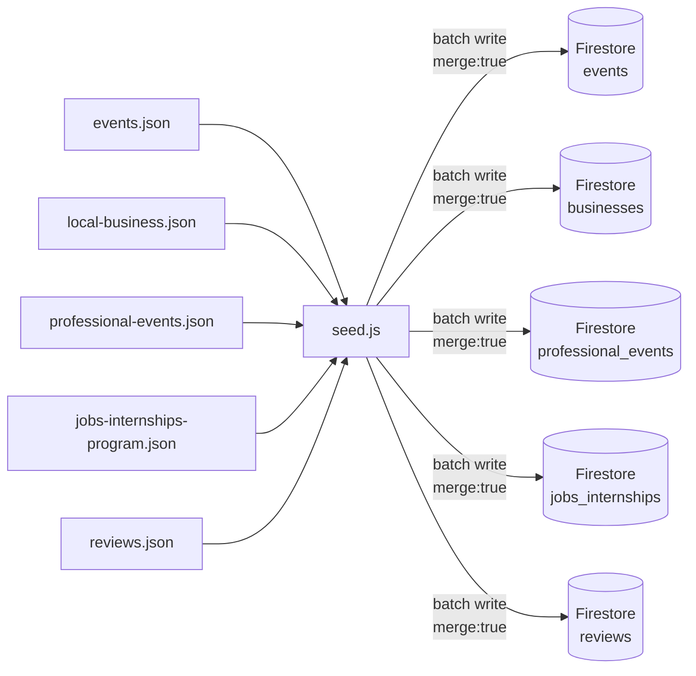

# default-data — Firestore Seed Data

This folder contains the default JSON datasets used to populate Firestore collections on first setup. All files are loaded by `backend/database/seed.js` via `npm run seed`.

---

## Files & Collections

| File | Firestore Collection | Description |
|---|---|---|
| `events.json` | `events` | NYC events (festivals, workshops, pop-ups, etc.) |
| `local-business.json` | `businesses` | Local NYC businesses |
| `professional-events.json` | `professional_events` | Professional development events |
| `jobs-internships-program.json` | `jobs_internships` | Job listings and internship programs |
| `reviews.json` | `reviews` | Sample user reviews |

---

## How Seeding Works



- Uses Firestore batch writes with `{ merge: true }` — safe to re-run, existing documents are updated not duplicated.
- Document IDs are derived from slugified names + dates (e.g., `central-park-yoga-2026-05-18`).

---

## Event Schema

```jsonc
{
  "id": "central-park-yoga-2026-05-18",
  "title": "Central Park Morning Yoga",
  "description": "Guided yoga session in the park...",
  "date": "2026-05-18",
  "time": "08:00",
  "time_end": "09:00",
  "category": "wellness",
  "focus": "fitness",
  "is_free": true,
  "min_price": null,
  "max_price": null,
  "location": "Central Park, Manhattan, NY",
  "coordinates": { "lat": 40.785091, "lng": -73.968285 },
  "link": "https://...",
  "tags": ["yoga", "wellness", "outdoor", "meditation"],
  "group_type": ["solo", "couple"],
  "experience_type": "event",
  "hosted_by": "NYC Parks",
  "source": "manual"
}
```

## Business Schema

```jsonc
{
  "id": "brooklyn-flea-market",
  "name": "Brooklyn Flea Market",
  "description": "Outdoor market with vintage goods...",
  "hours": "Sat-Sun 10:00-17:00",
  "location": "DUMBO, Brooklyn, NY",
  "coordinates": { "lat": 40.703, "lng": -73.987 },
  "category": "shopping",
  "link": "https://...",
  "phone": "+1-718-000-0000",
  "rating": 4.5,
  "is_active": true,
  "source": "manual"
}
```

## Education / Professional Event Schema

```jsonc
{
  "id": "google-tech-program-2026",
  "type": "event",
  "name": "Google Tech Program NYC",
  "focusArea": "Technology",
  "requirement": "0-1 years",
  "services": ["workshops", "networking", "mentorship"],
  "otherCategory": "",
  "registrationLink": "https://...",
  "dueDate": "2026-06-01"
}
```

## Job / Internship Schema

```jsonc
{
  "id": "nyc-tech-internship-2026",
  "type": "job",
  "name": "NYC Tech Summer Internship",
  "focusArea": "Technology",
  "requirement": "0-1 years",
  "services": ["internship", "mentorship"],
  "otherCategory": "",
  "registrationLink": "https://...",
  "dueDate": "2026-05-15"
}
```

---

## Adding New Seed Data

1. Add entries to the appropriate JSON file following the schema above.
2. Run `npm run seed` from the `backend/` directory.
3. The seed script uses `{ merge: true }`, so existing records are not overwritten — only new IDs are inserted.

> Seed data provides the baseline so the app works on day one without waiting for the live Apify + Gemini pipeline to populate Firestore.
